<p align="center">
  
</p>

<p align="center">
  <strong>Astro Rocket</strong> — A free, lightning-fast Astro 7 starter theme to build anything on.
</p>

<p align="center">
  <a href="https://astro.build"></a>
  <a href="https://tailwindcss.com"></a>
  <a href="https://www.typescriptlang.org"></a>
  <a href="https://github.com/hansmartensdev/astro-rocket/actions/workflows/deploy.yml"></a>
  <a href="LICENSE"></a>
  <a href="https://github.com/hansmartensdev/astro-rocket"></a>
  <a href="https://github.com/hansmartensdev/astro-rocket"></a>
</p>

<p align="center">
  
</p>

<p align="center">
  <em>Perfect Lighthouse scores.</em>
</p>


---

<details>
<summary><strong>Table of contents</strong></summary>

- [Overview](#overview)
- [What Astro Rocket has to offer](#what-astro-rocket-has-to-offer)
- [Quick Start](#quick-start)
- [Project Structure](#project-structure)
- [Commands](#commands)
- [Configuration](#configuration)
- [Internationalization (i18n)](#internationalization-i18n)
- [Design System](#design-system)
- [Components](#components)
- [Content Management](#content-management)
- [SEO](#seo)
- [Search](#search)
- [API Routes](#api-routes)
- [Deployment](#deployment)
- [Browser Support](#browser-support)
- [Performance](#performance)
- [Animations](#animations)
- [Security](#security)
- [Contributing](#contributing)
- [License](#license)
- [Links](#links)

</details>

---

## Overview

**Astro Rocket is an Astro 7 theme.**

It ships as a working site: homepage, about, services, contact, a blog and a projects portfolio — both with tags and pagination — a components showcase, and a 404 page. Underneath sits a library of **44 designed, accessible, TypeScript components** on a three-tier design-token system, with static search, SEO, opt-in i18n, dark mode, and 12 colour themes you can switch live in the browser.

Content is Markdown in `src/content/`, the rest is `site.config.ts`, and it deploys to Vercel, Netlify, Cloudflare, or as static files.

Use all of it or only the parts you need. The site you build on it is yours.

**[Live demo → astrorocket.dev](https://astrorocket.dev)** · **[Built by Hans Martens → hansmartens.dev](https://hansmartens.dev)**

> **Origins & credits.** Astro Rocket began as a fork of [Velocity](https://github.com/southwellmedia/velocity) by [Southwell Media](https://southwellmedia.com). Velocity's design system and component library are the foundation this theme was built on, and the credit for that work belongs to the Southwell Media team. Astro Rocket has developed on its own since then.

---

## What Astro Rocket has to offer

| Feature | Description |
|---------|-------------|
| **Astro 7** | Latest version with the Rust compiler, Vite 8, Content Layer API, and performance optimizations |
| **Tailwind CSS v4** | CSS-first configuration with OKLCH color system and fluid typography |
| **12 Colour Themes** | All 12 colour swatches are shown in the header dropdown — click one and the logo badge, blog image gradients, and every brand color update live instantly. No file edits, no rebuilds. The selector can be removed from the header once you've settled on a color. |
| **Scroll Progress Bar** | A thin 2px brand-coloured bar on the header edge that fills as you scroll. Enabled on the homepage (above the floating header), blog index, and post pages (below the solid header). Controlled via `showScrollProgress` and `scrollProgressPosition` props on the Header component. |
| **Design Tokens** | Three-tier token architecture (reference → semantic → component) |
| **44 Components** | 34 UI, 7 patterns, 2 layout, 1 hero — every entry in `component-registry.json`, all accessible with TypeScript |
| **Auto Logo & Favicon** | First letter of your site name on brand color — generated automatically from `site.config.ts`, no design tools needed. Prefer your own logo? Set `branding.logo.image` to a file in `public/`. |
| **Icon System** | Unified `Icon` component (Astro + React) — 350+ [Lucide](https://lucide.dev) UI icons and 3000+ [Simple Icons](https://simpleicons.org) brand icons via Iconify |
| **Typing Effect** | Animated typing effect in the hero section |
| **Page Animations** | Smooth page transitions via Astro View Transitions, scroll-triggered counter and score animations, scroll-reactive header, card hover effects, and a full suite of UI micro-animations — all with reduced-motion support |
| **SEO Toolkit** | Meta tags, JSON-LD structured data, sitemap, and robots.txt |
| **Static OG Image** | A polished default Open Graph image serves as social preview for all pages — no build-time generation required |
| **Colour Mode** | 3-state picker — **System / Light / Dark** with `localStorage` persistence and live OS-preference tracking under 'System'; surfaced as a pill dropdown in the header (and inside the mobile menu) |
| **Content Collections** | Type-safe blog, pages, authors, and FAQs with Zod validation |
| **API Routes** | Contact form and newsletter endpoints with validation |
| **Newsletter Signup** | Optional email signup in the "follow along" section of the blog index and every post, posting to a Resend audience. Off by default — set `RESEND_API_KEY` and `RESEND_AUDIENCE_ID`, then `newsletter.enabled` in `site.config.ts`. The `NewsletterForm` component can be placed anywhere else too. See [Newsletter Signup](#newsletter-signup) |
| **Table of Contents** | Optional table of contents on blog posts, auto-generated from MDX headings, with three layouts: inline card, sticky desktop sidebar, or `auto` (sidebar on `xl+`, inline card below). Includes `IntersectionObserver` scroll-spy. Off by default; per-post `toc: false` in frontmatter hides on a single post |
| **Blog Comments (Giscus / Cusdis / Artalk)** | Optional comments at the bottom of blog posts via a pluggable provider — [Giscus](https://giscus.app) (GitHub Discussions), the privacy-friendly [Cusdis](https://cusdis.com) (hosted or self-hosted), or self-hosted [Artalk](https://artalk.js.org) (point `comments.artalk.server` at your own instance — use an `https://` URL in production). Choose with `comments.provider`. **Lazy-loaded** so readers who don't scroll to comments pay zero network cost; reserved `min-height` prevents CLS. Theme and language follow the site. Off by default; per-post `comments: false` in frontmatter hides on a single post |
| **Durable Internal Links** | Link between posts by a stable canonical id with `<PostLink uid="…">` instead of a slug, so renaming a post never breaks inbound links. Ids resolve to the correct locale-aware URL at build time, and a broken reference **fails the build** rather than shipping a 404. Add an optional `uid` to a post's frontmatter to make it linkable |
| **Build-Time Content Validation** | The build fails with a clear error if two pieces of content resolve to the same URL within a locale (duplicate slugs across posts, projects, and pages), or if two posts claim the same canonical id — catching silent content mistakes before they ship |
| **Independent Footer Menu** | Header and footer navigation configured separately in `nav.config.ts` (`navItems`, `footerNavItems`, `legalLinks`) — add a Privacy or Imprint link to the footer without cluttering the main nav |
| **Static Search (Pagefind)** | Site-wide search in the header — a ⌘K / Ctrl+K modal powered by a [Pagefind](https://pagefind.app) index generated at build time. Zero JS until the modal opens; works on every deploy target. Hide it with `showSearch={false}` on the Header |
| **Project Galleries** | Multiple images per project: a `gallery` array in frontmatter swaps the hero image for a swipeable carousel, and the `<ProjectGallery>` MDX component renders an in-body carousel with a click-to-zoom lightbox. See [Project Galleries](#project-galleries) |
| **YouTube Embeds (Click-to-Play)** | `<YouTube id="…" title="…" />` in any MDX post or page renders a lightweight thumbnail facade — **zero YouTube JavaScript and no third-party cookies until the reader presses play**, then the player loads from privacy-friendly `youtube-nocookie.com`. Keeps article pages at Lighthouse 100; self-hosted files just use a native `<video>` tag |
| **Internationalization (i18n)** | Opt-in and off by default; with the flag off the build is byte-for-byte identical to a single-locale site. On, you get locale-prefixed routes, a `LanguageSwitcher`, `hreflang` tags and a `t()` helper. See [Internationalization (i18n)](#internationalization-i18n) |
| **React Islands** | Optional client-side interactivity where needed |

---

## Quick Start

### Prerequisites

- **Node.js 22.12.0+** (required for Astro 7)
- **pnpm 10.33.0** — the version in `packageManager`, which `corepack` installs for you

### Installation

```bash
# Clone the repository
git clone https://github.com/hansmartensdev/astro-rocket.git my-project
cd my-project

# Install dependencies
pnpm install

# Copy environment variables
cp .env.example .env

# Start development server
pnpm dev
```

Visit `http://localhost:4321` to see your site.

---

### Or try it in Docker, without installing anything

If you would rather not put a dependency tree on your own machine yet:

```bash
docker compose up --build
```

The site is then on **http://localhost:4321**. The build runs inside the
container, which can see this repository and nothing else of yours, and the
image that serves the site is nginx with the generated files in it — no Node,
no pnpm, no Astro.

To get the built files out instead of serving them:

```bash
docker compose run --rm export
```

That writes the site into `./dist`.

**Your `.env` is used.** Compose reads it and passes the settings in as build
arguments, so a container build carries the same configuration as any other.
The Resend and newsletter keys are the exception — they belong to the API
routes, which a container does not carry.

**What the container does not cover.** It serves the static build, and the
contact form and newsletter are the theme's only routes that are not
prerendered — they become a serverless function on a real deploy. In the
container they answer with an explanation instead, which the form displays.
Everything else — all pages, search, the colour themes, RSS, the sitemap — is
the real thing. For a full preview including the forms, use `pnpm dev` or
deploy to Vercel, Netlify or Cloudflare.


## Project Structure

```
astro-rocket/
├── public/                  # Static assets (fonts, favicon)
├── src/
│   ├── assets/              # Images and icons (processed by Astro)
│   ├── components/
│   │   ├── ui/              # UI component library (34 components)
│   │   │   ├── form/        # Button, Input, Textarea, Select, Checkbox, Radio, Switch
│   │   │   ├── data-display/ # Card, Badge, Avatar, Table, Pagination, Progress, Skeleton
│   │   │   ├── feedback/    # Alert, Toast, Tooltip
│   │   │   ├── overlay/     # Dialog, Dropdown, Tabs, VerticalTabs, Accordion
│   │   │   ├── layout/      # Separator
│   │   │   ├── primitives/  # Icon
│   │   │   ├── content/     # CodeBlock
│   │   │   └── marketing/   # Logo, CTA, NpmCopyButton, SocialProof, TerminalDemo
│   │   ├── patterns/        # Composed patterns (ContactForm, SearchInput, StatCard, etc.)
│   │   ├── layout/          # Header, Footer, Navigation, ThemeModeDropdown, ThemeSelector(Dropdown)
│   │   ├── seo/             # SEO, JsonLd, Breadcrumbs
│   │   ├── blog/            # Blog-specific components
│   │   └── landing/         # Landing page components
│   ├── content/             # Content collections
│   │   ├── blog/            # Blog posts (en/, es/, fr/)
│   │   ├── projects/        # Portfolio project pages
│   │   ├── authors/         # Author profiles
│   │   └── faqs/            # FAQ entries
│   ├── layouts/             # Page layouts
│   ├── lib/                 # Utilities (schema, cn)
│   ├── pages/               # Routes and API endpoints
│   │   ├── api/             # Contact, newsletter endpoints
│   │   └── blog/            # Blog routes
│   ├── styles/              # Global CSS and design tokens
│   │   ├── tokens/          # colors.css, typography.css, spacing.css
│   │   └── themes/          # 12 colour theme files
│   └── config/              # Site and navigation configuration
├── astro.config.mjs         # Astro configuration
├── package.json
└── tsconfig.json
```

---

## Commands

| Command | Description |
|---------|-------------|
| `pnpm dev` | Start development server with hot reload |
| `pnpm build` | Build for production |
| `pnpm preview` | Preview production build locally |
| `pnpm check` | Run Astro type checker |
| `pnpm lint` | Run ESLint |
| `pnpm lint:fix` | Fix ESLint issues |
| `pnpm format` | Format code with Prettier |
| `pnpm format:check` | Check code formatting |
| `pnpm test` | Run Vitest tests, watching for changes |
| `pnpm test:run` | Run Vitest once and exit — what CI runs |
| `pnpm validate` | Everything CI runs: lint, types, tests, build, output check |

---

## Configuration

### Site Configuration

Edit `src/config/site.config.ts`:

```typescript
const siteConfig = {
  name: 'Your Site Name',
  description: 'Your site description for SEO',
  url: 'https://yoursite.com',
  ogImage: '/og/default.png',
  author: 'Your Name',
  email: 'hello@yoursite.com',
  twitter: {
    site: '@yourhandle',
    creator: '@yourhandle',
  },
};
```

### Custom Logo

By default the logo is an auto-generated monogram — the first letter of `name` on the active brand color, no logo file required. To use your own logo image instead, drop a file in `public/` and set `branding.logo.image`:

```typescript
branding: {
  logo: {
    alt: 'Your Brand',
    image: '/logo.svg', // any file in public/ — replaces the monogram everywhere
  },
},
```

That single field swaps the monogram for your image in the header, footer, and anywhere `<Logo>` is rendered — **no layout edits needed**. Leave `image` unset to keep the monogram. Square marks and wide wordmarks both render correctly, and blog author avatars keep their initials.

### Environment Variables

Create a `.env` file from `.env.example`:

`SITE_URL` is the one that matters everywhere: canonical tags, `og:url`, `og:image`, RSS links and the sitemap are all built from it, and your host needs it set as an environment variable too, not only in your local `.env`. Leave it unset and the build says so and falls back to `https://example.com`.

```bash
# Required
SITE_URL=https://yoursite.com

# Optional - Analytics
PUBLIC_GA_MEASUREMENT_ID=G-XXXXXXXXXX
PUBLIC_GTM_ID=GTM-XXXXXXX

# Optional - Umami (privacy-friendly, cookieless analytics)
PUBLIC_UMAMI_WEBSITE_ID=xxxxxxxx-xxxx-xxxx-xxxx-xxxxxxxxxxxx
# PUBLIC_UMAMI_SRC=https://cloud.umami.is/script.js   # set when your snippet's src differs

# Optional - Contact form and newsletter (server-side only)
RESEND_API_KEY=your-resend-api-key
RESEND_AUDIENCE_ID=your-audience-id

# Optional - Verification
GOOGLE_SITE_VERIFICATION=your-code
BING_SITE_VERIFICATION=your-code
```

Astro Rocket ships with built-in support for **Google Analytics 4**, **Google Tag Manager**, and **Umami**. For Umami, set `PUBLIC_UMAMI_WEBSITE_ID` (the UUID from your Umami dashboard) and the tracking script loads automatically. Umami is cookieless and stores no personal data, so it loads without the cookie-consent banner.

Copy the Website ID **and** the script `src` out of the tracking snippet Umami shows you, and set `PUBLIC_UMAMI_SRC` whenever that `src` is not `https://cloud.umami.is/script.js` — which covers self-hosting and Umami Cloud's other instances alike. Set the **Domain** on the Umami website record to your bare hostname (`yoursite.com`), since Umami rejects events whose origin does not match it.

Both are the same silent failure: the script loads, the page is fine, and nothing is recorded. After deploying, check the **Network** tab for `POST /api/send` returning 200 — a successful `script.js` request proves only that the file was fetched.

### Newsletter Signup

A newsletter signup can appear in the "follow along" section at the foot of the blog index and of every blog post. It is **off by default**, because the form posts to `/api/newsletter`, which needs a Resend API key and audience. Without them the endpoint answers *"Newsletter service is not configured"* — so a site that showed the form before its owner had a mailing list would only be collecting failures.

To turn it on, set both variables in `.env`:

```bash
RESEND_API_KEY=your-resend-api-key
RESEND_AUDIENCE_ID=your-audience-id
```

Then flip the switch in `src/config/site.config.ts`:

```typescript
newsletter: {
  enabled: true,
},
```

The form itself is the `NewsletterForm` pattern component, so you can also drop it anywhere else in your own pages:

```astro
---
import NewsletterForm from '@/components/patterns/NewsletterForm.astro';
---
<NewsletterForm />
```

All of its text comes from the `newsletter.*` keys in `src/i18n/en.json`, and the props `placeholder`, `buttonText` and `successMessage` override them per usage. Submissions carry a hidden honeypot field that the endpoint checks before anything else.

---

## Internationalization (i18n)

Astro Rocket ships with **native, opt-in i18n** since 1.3.0. When the flag is off (the default) the build is byte-for-byte identical to a single-locale Astro Rocket site — no `/en/` prefix, no `LanguageSwitcher`, no `hreflang`, no JS for locale routing. Turn it on and you get locale-prefixed routes, an accessible `LanguageSwitcher` dropdown in the header (and mobile menu), `hreflang` SEO tags, and a `t()` translation helper backed by JSON dictionaries.

### Enabling i18n

Open `src/config/i18n.config.ts` and flip the flag:

```ts
const i18nConfig: I18nConfig = {
  enabled: true,                     // master switch
  defaultLocale: 'en',               // stays at the site root (/about)
  locales: ['en', 'nl'],             // additional locales live at /nl/about
  localeNames: {
    en: 'English',
    nl: 'Nederlands',
    // …add more as needed; any BCP 47 code works
  },
  detectBrowserLocale: false,
};
```

Astro's native i18n is wired up automatically when `enabled: true` AND `locales.length > 1`. With `prefixDefaultLocale: false`, the default locale stays at the site root and additional locales live under `/<locale>/`.

### Pages in another language

The bundled pages — the **home page, About, Services and Contact** — are already locale-aware, exactly like the blog and projects. Enable a second locale and `/<locale>`, `/<locale>/about`, `/<locale>/services` and `/<locale>/contact` are generated automatically, so the `LanguageSwitcher` never lands on a 404. You do **not** create `src/pages/<locale>/about.astro` files for these — remove any you added previously, as they would collide with the generated routes.

Their text lives in the locale dictionaries under the `pages.*` keys (`pages.home`, `pages.about`, `pages.services`, `pages.contact`). **To translate a page, copy those keys from `src/i18n/en.json` into your locale file (e.g. `src/i18n/nl.json`) and translate the values — there is no markup to touch.** Anything you haven't translated yet falls back to the default locale, so a localized page is never blank. The design lives in one shared view per page under `src/components/pages/views/`, rendered by both the default route and the `/<locale>/…` route.

Adding your **own** new page follows the same three-file pattern — a view holding the design, a default-locale route, and a locale-prefixed route:

```astro
---
// src/components/pages/views/PricingView.astro — the design; copy comes from the dictionary
import { t, defaultLocale } from '@/i18n';
interface Props { locale?: string }
const { locale = defaultLocale } = Astro.props;
---
<h1>{t('pages.pricing.heading', locale)}</h1>
```

```astro
---
// src/pages/pricing.astro          →  /pricing            (default locale)
import PricingView from '@/components/pages/views/PricingView.astro';
import { defaultLocale } from '@/i18n';
---
<PricingView locale={defaultLocale} />
```

```astro
---
// src/pages/[locale]/pricing.astro →  /<locale>/pricing   (every other locale)
import PricingView from '@/components/pages/views/PricingView.astro';
import { getSecondaryLocales } from '@/i18n';
export function getStaticPaths() {
  return getSecondaryLocales().map((locale) => ({ params: { locale } }));
}
const { locale } = Astro.params;
---
<PricingView locale={locale} />
```

For lists and structured sections (an array of FAQ items, feature cards, …) use `tData('pages.pricing.faqs', locale)`, which returns arrays/objects from the dictionary with the same default-locale fallback as `t()`. Or, for a quick one-off, just write a standalone `src/pages/nl/pricing.astro` directly. Either way, the `LanguageSwitcher` automatically builds links to `/<locale>/<current-path>` for every configured locale.

### Translating UI strings

UI strings (button labels, "Read more", "Published on", etc.) live in `src/i18n/<locale>.json`. Astro Rocket ships English (`en.json`) and Dutch (`nl.json`) out of the box. Use the `t()` helper in any `.astro` file:

```astro
---
import { t, getLocaleFromPath } from '@/i18n';
const locale = getLocaleFromPath(Astro.url.pathname);
---

<a href="/blog">{t('common.readMore', locale)}</a>
```

To add another language, drop a new `src/i18n/<code>.json` mirroring the structure of `en.json` — it's loaded automatically, with no edits to `src/i18n/index.ts`. Just add the locale code to `locales` in `src/config/i18n.config.ts` so it gets served. Missing keys fall back to the default locale's value, then to the key itself — so partial translations are safe.

### Navigation, legal links & the logo

You write each navigation entry once in `nav.config.ts` (`navItems`, `footerNavItems`, `legalLinks`); the Header and Footer localize it for the active locale automatically, so the nav and logo keep visitors inside their locale:

- **Paths** are locale-prefixed via `localizedPath` — `/blog` stays `/blog` on the default locale and becomes `/<locale>/blog` elsewhere. External, `mailto:`/`tel:`, and `#anchor` hrefs are left untouched, and the logo points at the locale's home (`/` or `/<locale>`).
- **Labels** are translated when an item carries a `labelKey` pointing at a string in `src/i18n/<locale>.json` (the bundled items use `nav.items.*`). Without a `labelKey`, the literal `label` is used as-is.

For the rare case where a locale needs a structurally different label or path (e.g. a localized slug like `/over-ons`), add a per-locale `locales` override to the item:

```ts
{ label: 'About', href: '/about', order: 4, labelKey: 'nav.items.about',
  locales: { nl: { href: '/over-ons' } } },
```

With i18n off, none of this runs and the nav renders exactly as written.

### Content collections

Blog posts, projects, and pages already carry a `locale` field on their schema (`src/content.config.ts`), validated against the `locales` you list in `src/config/i18n.config.ts` — register a locale there and the content schema accepts it automatically, with no enum to edit. Organize translated content by locale folder:

```
src/content/blog/en/hello-world.mdx
src/content/blog/nl/hallo-wereld.mdx
src/content/projects/en/studio-portfolio.mdx
src/content/projects/nl/studio-portfolio.mdx
```

> **Switching the default locale.** Changing `defaultLocale` in `i18n.config.ts` is a routing label — it controls which locale serves at the site root, not which content folder gets read. To make a different language the default, also rename the matching content folder (e.g. `src/content/blog/en/` → `src/content/blog/zh-CN/`) so the root URL resolves to the right posts. The locale code in `i18n.config.ts` and the folder name under `src/content/blog/` must match.

> **Localized blog routing is automatic.** Enable a locale in `i18n.config.ts`, drop posts under its folder (e.g. `src/content/blog/nl/`), and the whole blog is served at that locale's prefix with no extra wiring: the index (`/nl/blog`), individual posts (`/nl/blog/<slug>`), pagination (`/nl/blog/page/N`) and tag archives (`/nl/blog/tag/<tag>`) are all generated, and every in-locale link — cards, tag chips, pagination, breadcrumbs, related posts — stays inside that locale. The `defaultLocale` keeps its prefix-free URLs (`/blog`). A locale with no posts yet still gets a `/<locale>/blog` index that shows the empty state, so the `LanguageSwitcher` never lands on a 404. You do **not** create `src/pages/<locale>/blog*` files yourself — remove any you added previously, as they would collide with the generated routes. (The bundled static pages — home, About, Services and Contact — are generated for every locale the same way; you translate their text in `src/i18n/<locale>.json`, as shown in *Pages in another language* above.)
>
> On blog posts, the `LanguageSwitcher` and the `hreflang` tags link to each translation's **real** URL — paired by canonical `uid` when the posts declare one (so a translation can live at a different slug, `/blog/hello` ↔ `/nl/blog/hallo`), otherwise by an identical slug. A locale with no translation of the current post is dropped from `hreflang`, and the switcher falls back to that locale's blog index instead of a dead URL. (Other page types resolve alternates by swapping the locale segment, which is correct when slugs match across locales.)
>
> **Projects are localized the same way.** Drop translations under `src/content/projects/<locale>/` and the whole projects section is served at that locale's prefix — index (`/nl/projects`), each project (`/nl/projects/<slug>`), pagination (`/nl/projects/page/N`), and tag archives (`/nl/projects/tag/<tag>`), with every in-locale link, `hreflang`, and the `LanguageSwitcher` resolving inside that locale. Projects share one slug across locales: keep the same filename in each locale folder (e.g. `en/studio-portfolio.mdx` ↔ `nl/studio-portfolio.mdx`) and the theme pairs them automatically. As with the blog, you do **not** create `src/pages/<locale>/projects*` files yourself.

### Performance

The whole system is build-time. No client-side routing, no framework hydration for the `LanguageSwitcher` — just static HTML and a tiny vanilla-JS open/close handler for the dropdown panel. Verified zero output-size delta on the disabled path between 1.2.1 and 1.3.0.

---

## Design System

Astro Rocket uses a three-tier design token system with OKLCH colors for perceptual uniformity:

1. **Primitives** (`src/styles/tokens/primitives.css`) — raw color scales (gray, brand, status)
2. **Semantic tokens** (`src/styles/themes/*.css`) — purpose-based mappings (background, foreground, border, etc.)
3. **Tailwind** (`src/styles/global.css`) — `@theme` directives that expose tokens as utility classes

### Switching Themes

Astro Rocket ships with 12 colour themes, all based on Tailwind's color palette. All 12 are shown as colour swatches in the header dropdown (`ThemeSelectorDropdown`) on desktop and in the mobile menu (`ThemeSelector`). Clicking a swatch applies the theme instantly — the logo badge, blog image gradients, and every brand color on the page update live. No file edits, no rebuilds. This is a key difference from the original Velocity theme, where switching theme requires editing a CSS import file and rebuilding.

The 12 themes in order: Orange, Amber, Lime, Emerald, Teal, Cyan, Sky, Blue (default), Indigo, Violet, Purple, and Magenta. The `colourThemes` array in `src/lib/themes.ts` is the registry: it controls which swatches are shown, in what order, and whether each is offered at all (`showInSelector`). You can also **remove the selector from the header entirely** once you've settled on a color — just remove `showThemeSelector` from the layout file.

The theme files live in `src/styles/themes/`:

```
amber.css   blue.css    cyan.css    emerald.css
indigo.css  lime.css    magenta.css orange.css
purple.css  sky.css     teal.css    violet.css
```

### Customizing Brand Colors

Edit `src/styles/tokens/primitives.css` and update the `--brand-*` OKLCH values:

```css
:root {
  --brand-50:  oklch(97.5% 0.02 45);  /* lightest tint */
  --brand-100: oklch(94.8% 0.04 45);
  --brand-200: oklch(87.5% 0.08 45);
  --brand-300: oklch(77.8% 0.14 45);
  --brand-400: oklch(68.5% 0.19 40);
  --brand-500: oklch(62.5% 0.22 38);  /* primary brand color */
  --brand-600: oklch(53.2% 0.19 38);
  --brand-700: oklch(45.5% 0.16 38);
  --brand-800: oklch(37.2% 0.13 38);
  --brand-900: oklch(26.5% 0.09 38);
}
```

OKLCH values are `oklch(lightness chroma hue)`. To shift your brand to blue, change the hue from `38-45` to `~260`. Use [oklch.com](https://oklch.com) to pick colors visually.

### Creating a New Theme

1. Duplicate `src/styles/themes/default.css` as your starting point
2. Implement all ~35 semantic tokens for both `:root` (light) and `.dark` (dark):

   **Backgrounds**: `--background`, `--background-secondary`, `--background-tertiary`, `--background-elevated`

   **Foregrounds**: `--foreground`, `--foreground-secondary`, `--foreground-muted`, `--foreground-subtle`

   **Borders**: `--border`, `--border-strong`, `--border-subtle`

   **Interactive**: `--primary`, `--primary-hover`, `--primary-foreground`, `--secondary`, `--secondary-hover`, `--secondary-foreground`, `--accent`, `--accent-hover`, `--accent-light`

   **Surfaces**: `--muted`, `--muted-foreground`, `--card`, `--card-border`, `--input-bg`, `--input-border`, `--input-focus`, `--ring`

   **Destructive**: `--destructive`, `--destructive-foreground`

   **Gradients**: `--gradient-start`, `--gradient-end`

   **Invert sections**: `--surface-invert`, `--surface-invert-secondary`, `--surface-invert-tertiary`, `--on-invert`, `--on-invert-secondary`, `--on-invert-muted`, `--border-invert`, `--border-invert-strong`

3. Update the import in `src/styles/tokens/colors.css` to point to your new theme file

### Colour Mode

Astro Rocket ships a 3-state colour-mode system — **System / Light / Dark** — instead of a binary toggle. The user's choice is persisted in `localStorage` under the key `theme`, and the resolved appearance is applied via the `.dark` class on `<html>`. Under `'system'`, the page tracks `window.matchMedia('(prefers-color-scheme: dark)')` live, so flipping the OS theme updates the page in real time without a reload.

State contract:

| Storage / DOM | Values | Role |
|---|---|---|
| `localStorage.theme` | `'system' \| 'light' \| 'dark'` | The user's saved choice (default `'system'`) |
| `<html data-theme-mode="…">` | mirrors the saved mode | Drives the trigger icon (monitor / sun / moon) via CSS |
| `<html>.dark` | present or absent | Resolved appearance — Tailwind dark variant keys off this |

Defaults are seeded directly on the `<html>` element in `src/layouts/BaseLayout.astro` so JS-disabled visitors still see a sensible state:

```html
<html lang="en" class="scroll-smooth dark" data-theme="blue" data-theme-mode="system">
```

Flash-of-wrong-theme is prevented by an inline `<script>` in `<head>` that runs synchronously before body paint, reads `localStorage.theme`, and reconciles `data-theme-mode` + `.dark`. The same script also re-applies on `astro:before-swap` / `astro:after-swap` to handle view transitions, and subscribes once to the OS-preference media query.

The picker is exposed as a pill-shaped dropdown in the header — `ThemeModeDropdown` — and re-rendered inside the mobile menu below the `md` breakpoint, so both desktop and mobile users get the full 3-state picker:

```astro
---
import ThemeModeDropdown from '@/components/layout/ThemeModeDropdown.astro';
---

<ThemeModeDropdown />
```

The full design — bootstrap script, dropdown anatomy, the live "Currently dark/light" sub-line under 'System', and how two component instances stay state-synced — is written up in the [System, Light, Dark blog post](https://astrorocket.dev/blog/colour-mode-system).

> **Why `localStorage` for colour mode but `sessionStorage` for the colour palette?** They serve different intents. The colour mode is the user's accessibility / preference setting and should survive reloads and new tabs — `localStorage`. The 12-swatch colour palette is a brand-discovery toy that should reset on every new visit so first impressions stay on-brand — `sessionStorage`. Keeping them on different storage tiers is intentional, not accidental.

### WCAG Contrast Requirements

Foreground tokens are documented with their contrast ratios inline. When customizing, maintain these minimums:

| Token | Minimum ratio | Standard |
|-------|:---:|:---:|
| `--foreground` | 7:1 | WCAG AAA |
| `--foreground-secondary` | 7:1 | WCAG AAA |
| `--foreground-muted` | 4.5:1 | WCAG AA |
| `--foreground-subtle` | 4.5:1 | WCAG AA |
| Status `-foreground` tokens | 4.5:1 | WCAG AA (on their `-light` bg) |

### Using Design Tokens

```astro
<!-- Tailwind utilities (recommended) -->
<div class="bg-background text-foreground">
  <h1 class="text-primary font-display">Hello</h1>
</div>

<!-- CSS custom properties -->
<style>
  .custom {
    background: var(--background-secondary);
    color: var(--foreground);
  }
</style>
```

---

## Components

Astro Rocket includes 44 components across four categories. All UI components use [class-variance-authority (CVA)](https://cva.style) for type-safe variant management.

### UI Components (34)

#### Form (`ui/form/`)

| Component | Description |
|-----------|-------------|
| Button | Interactive button with primary, secondary, outline, ghost, destructive variants and loading state |
| Input | Text input with label, hint, and error states |
| Textarea | Multi-line text input |
| Select | Dropdown selection |
| Checkbox | Boolean toggle with indeterminate state |
| Radio | Single selection from group |
| Switch | Toggle switch input |

#### Data Display (`ui/data-display/`)

| Component | Description |
|-----------|-------------|
| Card | Content container with variant, padding, and hover options |
| Badge | Status labels and tags with contextual variants |
| Avatar | User images with fallback |
| AvatarGroup | Grouped avatar display with overlap |
| Table | Styled data table |
| Pagination | Page navigation controls |
| Progress | Progress bar indicator |
| Skeleton | Loading placeholders |
| ProofTile | Centred tile for a fact, feature, or process step — brand icon or step number above bold text, in two sizes |
| GoogleMap | Consent-aware Google Maps embed: a setup prompt without an API key, a "Load Map" placeholder until consent is granted, the iframe after |

#### Feedback (`ui/feedback/`)

| Component | Description |
|-----------|-------------|
| Alert | Contextual feedback messages (info, success, warning, error) |
| Toast | Temporary notification messages |
| Tooltip | Hover tooltips with positioning |

#### Overlay (`ui/overlay/`)

| Component | Description |
|-----------|-------------|
| Dialog | Modal overlay |
| Dropdown | Menu with trigger |
| Tabs | Horizontal tabbed content panels |
| VerticalTabs | Vertical tab navigation |
| Accordion | Collapsible content sections |
| ConsentBanner | Cookie consent with Google Consent Mode v2 — accept, decline, or a settings panel. Renders only when `PUBLIC_CONSENT_ENABLED` is on |

#### Layout (`ui/layout/`)

| Component | Description |
|-----------|-------------|
| Separator | Visual divider between sections |

#### Primitives (`ui/primitives/`)

| Component | Description |
|-----------|-------------|
| Icon | Unified icon component (Astro + React) powered by Iconify. Supports all [Lucide](https://lucide.dev) icons (`lucide:*`) and all [Simple Icons](https://simpleicons.org) brand icons (`simple-icons:*`). Includes shorthand names for common social and brand icons. Five size variants: `xs`, `sm`, `md`, `lg`, `xl`. |

#### Content (`ui/content/`)

| Component | Description |
|-----------|-------------|
| CodeBlock | Syntax-highlighted code display |

#### Marketing (`ui/marketing/`)

| Component | Description |
|-----------|-------------|
| Logo | Auto-generated monogram badge — renders the first letter of `siteConfig.name` on the active brand color. Five sizes: `sm`, `md`, `lg`, `xl`, `2xl`. No logo file required — or set `branding.logo.image` in `site.config.ts` to use a custom image instead. |
| CTA | Call-to-action sections with slot-based composition |
| NpmCopyButton | NPM install command with copy-to-clipboard |
| SocialProof | Testimonial and trust indicator cards |
| TerminalDemo | Animated terminal demonstration (React) |

### Pattern Components (7)

| Component | Description |
|-----------|-------------|
| ContactForm | Complete contact form with validation |
| NewsletterForm | Email subscription form |
| FormField | Reusable form field wrapper |
| SearchInput | Search input with icon |
| PasswordInput | Password input with visibility toggle |
| StatCard | Statistics display card |
| EmptyState | Empty state placeholder with icon and action |

### Other Categories

| Category | Count | Components |
|----------|-------|------------|
| Layout | 2 | Header (with scroll progress bar), Footer |
| Hero | 1 | Hero section with centered/split layouts, grid pattern, and typing effect |

`src/components/` also holds components built for this site's own pages — blog, landing, SEO and theme-switching pieces, the `YouTube` embed for MDX, and the `Callout` and `LetterGlitchBand` patterns. They are outside the 44 that `component-registry.json` counts.

### Usage Example

```astro
---
import { Button, Input, Card } from '@/components/ui';
---

<Card>
  <Input label="Email" type="email" name="email" required />
  <Button variant="primary">Submit</Button>
</Card>
```

### Icon Usage

```astro
---
import Icon from '@/components/ui/primitives/Icon/Icon.astro';
---

<!-- Lucide UI icons — use any icon name from lucide.dev -->
<Icon name="arrow-right" size="md" />
<Icon name="mail" size="sm" />
<Icon name="layers" size="lg" />

<!-- Simple Icons brand icons — shorthand names available -->
<Icon name="github" size="md" />
<Icon name="x-twitter" size="md" />
<Icon name="brand-astro" size="md" />
<Icon name="brand-tailwind" size="md" />

<!-- Or use the full Iconify name directly -->
<Icon name="simple-icons:vercel" size="md" />
<Icon name="lucide:rocket" size="xl" />
```

All UI components are imported via barrel exports from `@/components/ui`. View all components at `/components` in development.

---

## Content Management

### Blog Posts

Create posts in `src/content/blog/[locale]/`:

```markdown
---
title: "Your Post Title"
description: "Brief description for SEO"
publishedAt: 2026-01-30
author: "Author Name"
tags: ["astro", "tutorial"]
uid: "your-post-id"        # optional — stable id used by <PostLink> for internal links
locale: en
---

Your content here...
```

To link from one post to another, use `<PostLink uid="target-post-id">link text</PostLink>` in your MDX instead of a hard-coded `/blog/...` URL. The id resolves to the right URL at build time, and a broken reference fails the build — so renaming a post never leaves a dead internal link. Give a post an optional `uid` (above) to make it a link target. The [configuration guide](/blog/astro-rocket-configuration-guide) post has the full walkthrough.

### Project Cards

Projects live in `src/content/projects/<locale>/` (the bundled ones in `src/content/projects/en/`) as one MDX file per project. Each one carries an `icon` — any [Lucide](https://lucide.dev/icons/) name — shown on its card in the projects listing and on the homepage:

```yaml
---
title: "E-Commerce Store"
description: "..."
icon: "shopping-bag"
---
```

Give every project its own. The card is mostly text, so one repeated icon across the grid makes them read as placeholders. Unset, it falls back to `layers`.

### Project Galleries

There are two ways to show more than one image on a project.

**1. Hero carousel (frontmatter).** Add a `gallery` array and the project hero swaps the single `image` for a swipeable carousel (touch swipe, prev/next arrows, dot indicators, keyboard navigation). The first slide is the lead image:

```yaml
---
title: "My Product"
description: "..."
gallery:
  - src: "../../assets/projects/shot-1.jpg"
    alt: "Dashboard view"
  - src: "../../assets/projects/shot-2.jpg"
    alt: "Settings page"
---
```

Keep the single `image` field set as well — project cards on the index and homepage still use it.

**2. In-body carousel with lightbox (MDX).** For an e-commerce-style gallery inside the project body, import the `ProjectGallery` component. Clicking a slide opens a full-screen lightbox, and each image takes an optional caption:

```mdx
import ProjectGallery from '@/components/projects/ProjectGallery.astro';
import shot1 from '@/assets/projects/shot-1.jpg';
import shot2 from '@/assets/projects/shot-2.jpg';

<ProjectGallery
  images={[
    { src: shot1, alt: 'Dashboard', caption: 'The main dashboard' },
    { src: shot2, alt: 'Settings' },
  ]}
/>
```

**3. Video slides.** Both carousels also accept self-hosted video slides — drop an `.mp4` (or `.webm`) in `public/`, reference it by root-relative path, and give it a **required poster image**:

```yaml
gallery:
  - video: "/videos/demo.mp4"
    poster: "../../assets/projects/demo-poster.jpg"
    alt: "30-second product demo"
  - src: "../../assets/projects/shot-1.jpg"
    alt: "Dashboard view"
```

The same shape works in `<ProjectGallery>` (`{ video, poster, alt, caption? }`). Video slides render the poster with `preload="none"`, so **zero video bytes are downloaded until the visitor presses play** — the poster goes through the regular image pipeline and the Lighthouse scores stay intact. Swiping away from a playing video pauses it. YouTube/Vimeo embeds are deliberately not supported: third-party iframes drag in scripts, cookies, and consent requirements that this theme avoids.

Both carousels are dependency-free (native scroll-snap plus a small vanilla script) and lazy-load every slide after the first, so they don't cost you the Lighthouse score. `src/content/projects/ecommerce-store.mdx` demonstrates both in one file.

### Querying Content

```astro
---
import { getCollection } from 'astro:content';

const posts = await getCollection('blog', ({ data }) => {
  return import.meta.env.PROD ? !data.draft : true;
});
---
```

---

## SEO

### Automatic Features

- **Meta tags**: Title, description, canonical URL
- **Open Graph**: Complete OG tags for social sharing
- **Twitter Cards**: Large image cards
- **JSON-LD**: WebSite, Organization, BlogPosting, Breadcrumb, FAQ schemas
- **Sitemap**: Auto-generated at `/sitemap-index.xml`
- **robots.txt**: Dynamic generation with sitemap reference
- **OG Images**: A static default OG image serves all pages and blog posts

### Using the SEO Component

```astro
---
import SEO from '@/components/seo/SEO.astro';
---

<head>
  <SEO
    title="Page Title"
    description="Page description"
  />
</head>
```

### OG Image

Every post, project and blog tag archive gets its own 1200×630 share card, drawn at build time from the page title and your brand colour and written out as a PNG under `/og/`. Pages without a card of their own use `/og/default.png`, generated from `name` and `tagline` in `src/config/site.config.ts`. Point `ogImage` at a file in `public/` to use your own instead.

A post or project that has its own **raster** cover (`.png`, `.jpg`, `.webp`, `.gif`) uses that as its share image. An SVG cover does not: social platforms don't render SVG, and the theme's cover SVGs colour themselves from CSS custom properties that only exist on the page — fetched on their own, they come out transparent. Posts with an SVG cover get the generated card instead.

Cards are drawn with `sharp` using the fonts on the build machine. Hosted builders ship fonts; a bare container image may not, and the build warns if it finds none.

---

## Search

Site-wide static search is powered by [Pagefind](https://pagefind.app) and surfaced as a search button in the header that opens a command-palette style modal (also bound to <kbd>⌘K</kbd> / <kbd>Ctrl+K</kbd>).

**How it works**

- The index is generated automatically at the end of every `astro build` by the `pagefind()` hook in `astro.config.mjs`. It indexes the real output directory on every deploy target (Vercel, Netlify, Cloudflare) — no extra build command needed.
- The header and footer carry `data-pagefind-ignore`, so navigation chrome never pollutes results.
- The modal lazy-loads the Pagefind bundle on first open, so search adds **zero JavaScript** to the initial page load and doesn't touch the Lighthouse score.

**Trying it locally**

The index only exists after a production build, so search has no results under `astro dev` (the modal tells you this instead of failing):

```bash
pnpm build && pnpm preview
```

**Turning it off**

The search button shows by default. Hide it per header instance:

```astro
<Header showSearch={false} />
```

---

## API Routes

### Contact Form

**POST** `/api/contact`

```typescript
// Request (FormData)
{
  name: string,      // 2-100 chars
  email: string,     // Valid email
  subject: string,   // Required
  message: string,   // 10-5000 chars
  honeypot: string   // Must be empty (spam check)
}

// Response
{ success: true }
// or
{ success: false, errors: { field: ["message"] } }
```

### Newsletter

**POST** `/api/newsletter`

```typescript
// Request (FormData)
{ email: string }

// Response
{ success: true }
// or
{ success: false, error: "message" }
```

---

## Deployment

Configuration files included for major platforms.

### Vercel (Recommended)

```bash
vercel
```

### Netlify

```bash
netlify deploy --prod
```

### Cloudflare

Astro's Cloudflare adapter (`@astrojs/cloudflare`) targets **Cloudflare Workers** (the platform behind today's "Workers & Pages"): the prerendered pages are served as static assets and the `/api/*` routes — the contact form and newsletter — run as the Worker. Build with the Cloudflare target, then deploy with Wrangler:

```bash
DEPLOY_TARGET=cloudflare pnpm build
npx wrangler deploy
```

The build generates the Worker and static-asset config automatically. The bundled `wrangler.toml` deliberately does **not** set `nodejs_compat`: the adapter prerenders every page inside workerd at build time, and that flag makes the prerender emit `[object Object]` instead of HTML for every page, without failing the build. If the contact form or newsletter need Node built-ins once deployed, set the flag on the Worker in the Cloudflare dashboard rather than in `wrangler.toml`. Prefer the dashboard? In **Workers & Pages → Create → Connect to Git**, set the build command to `DEPLOY_TARGET=cloudflare pnpm build`. Either way, add your secrets — `RESEND_API_KEY`, `RESEND_FROM_EMAIL`, `RESEND_AUDIENCE_ID` — plus `SITE_URL` as environment variables so the contact form and newsletter work.

### Static export (no serverless)

`pnpm build` uses the default Vercel adapter and writes the static site to `dist/client/`. You can host that folder on any static host — but the `/api/*` routes (contact form, newsletter) need a serverless/edge runtime, so on a purely static host you'd wire those forms up to an external service instead.

---

## Browser Support

- Chrome (last 2 versions)
- Firefox (last 2 versions)
- Safari (last 2 versions)
- Edge (last 2 versions)

---

## Performance

Astro Rocket is optimized for Core Web Vitals:

- **Lighthouse Score**: 100/100/100/100 on both mobile and desktop
- **Zero JavaScript** by default (islands architecture)
- **Optimized fonts** with `font-display: swap`
- **Image optimization** via Astro's built-in processing
- **Prefetching** for instant page transitions

---

## Animations

Every page in Astro Rocket includes purposeful animations that make the site feel polished and alive. All animations respect the user's `prefers-reduced-motion` setting — they are disabled automatically for users who prefer less motion.

### Page transitions

Astro Rocket uses Astro's built-in `<ClientRouter />` (View Transitions API) to animate between pages. Instead of a full browser reload, content fades smoothly from one page to the next. This is enabled globally in `BaseLayout.astro` and requires no per-page configuration.

### Scroll-triggered animations

Two components use an `IntersectionObserver` to trigger animations when elements enter the viewport:

- **Counter animation** — the stats block on the homepage (Years Experience, Projects Delivered, etc.) counts up from zero when it scrolls into view. Each number animates with a cubic ease-out over 1.2 seconds.
- **Lighthouse score bars** — the `LighthouseScores` landing component animates its score bars into place as the section becomes visible.

### Scroll-reactive header

The floating header changes its appearance as the user scrolls. When the page is at the top, the header is transparent with inverted text. Once the user scrolls past 60px, the header gains a solid background and the text flips to normal colors — all driven by CSS transitions via a `data-scrolled` attribute.

### Scroll progress bar

A thin 2px brand-coloured bar on the header edge that grows from left to right as the user scrolls, showing reading progress at a glance. Enable it with two props on the `<Header>` component:

| Prop | Type | Default | What it does |
|------|------|:-------:|--------------|
| `showScrollProgress` | `boolean` | `false` | Renders the progress bar |
| `scrollProgressPosition` | `'top'` \| `'bottom'` | `'bottom'` | Edge of the header where the bar sits |

The bar is enabled by default on three page types: the **homepage** (above the floating header), the **blog index**, and **individual blog posts** (both below the solid bar header). Use `scrollProgressPosition="top"` on a floating capsule header and `'bottom'` on a solid bar header. The bar colour always matches `--color-brand-500` and updates instantly when the visitor switches themes.

### Card hover effects

Cards throughout the site lift slightly on hover (`-translate-y-1`) and gain a subtle shadow. This is a Tailwind utility applied consistently to all interactive cards.

### UI micro-animations

The full animation library is defined in `src/styles/global.css`. These classes are used by components throughout the site:

| Class | What it does |
|-------|-------------|
| `animate-fade-in` | Fades an element from transparent to visible (0.5s ease-out) |
| `animate-slide-up` | Slides an element up from 12px below while fading in (0.5s ease-out) |
| `animate-slide-down` | Slides an element down from 12px above while fading in (0.5s ease-out) |
| `animate-dropdown-in` | Slides and scales a dropdown menu into view (0.2s spring) |
| `animate-dropdown-out` | Collapses a dropdown menu out of view (0.15s) |
| `animate-sheet-up` | Slides a bottom sheet up from off-screen (0.25s spring) |
| `animate-menu-down` | Slides the mobile navigation drawer open (0.25s spring) |
| `animate-tab-enter` | Crossfades tab panel content when switching tabs |
| `animate-toast-in` | Slides a toast notification in from the right (350ms spring) |
| `animate-tooltip-in` | Fades and scales a tooltip into view |
| `animate-pulse` | Breathing pulse for skeleton loading states |
| `animate-spin` | Continuous rotation for loading spinners |
| `animate-shake` | Brief shake for error feedback (400ms) |

Animation delay utilities (`.delay-0` through `.delay-5`, in 50ms steps) let you stagger multiple elements into view.

---

## Security

Astro Rocket builds to a **static site** — plain HTML, CSS, and JavaScript with no server or database in what you deploy. The attack surface is small by design.

**The only server-side code** is the optional contact and newsletter endpoints (`src/pages/api/`). Both validate input with [Zod](https://zod.dev), use a honeypot against bots, and HTML-escape submitted values before placing them in the notification email. Everything else is prerendered at build time.

**About `pnpm audit`.** An audit will report advisories in the dependency tree. Almost all of them come from the **build-time tooling of the deploy adapters** — Netlify and Cloudflare each bring a large local-development toolchain. That code runs only during `astro build` on your own machine; it is never part of the deployed site and never reaches a visitor.

**Reporting a security issue.** If you find a real vulnerability in the theme itself, please report it privately — open a [GitHub security advisory](https://github.com/hansmartensdev/Astro-Rocket/security/advisories/new) or email hello@hansmartens.dev — rather than a public issue, so it can be fixed before it's widely known.

---

## Contributing

Contributions are welcome!

1. Fork the repository
2. Create a feature branch (`git checkout -b feature/amazing-feature`)
3. Commit your changes (`git commit -m 'Add amazing feature'`)
4. Push to the branch (`git push origin feature/amazing-feature`)
5. Open a Pull Request

Please ensure your code passes linting (`pnpm lint`) and type checking (`pnpm check`) before submitting.

---

## License

MIT License — see [LICENSE](LICENSE) for details.

---

## Links

- [Astro Rocket on GitHub](https://github.com/hansmartensdev/astro-rocket)
- [Velocity](https://github.com/southwellmedia/velocity) by [Southwell Media](https://southwellmedia.com) — the theme Astro Rocket was originally forked from
- [Astro Documentation](https://docs.astro.build)
- [Tailwind CSS v4](https://tailwindcss.com/docs)

---

**Astro Rocket** is designed and maintained by [Hans Martens](https://hansmartens.dev).
Originally forked from [Velocity](https://github.com/southwellmedia/velocity) by [Southwell Media](https://southwellmedia.com) — credit to them for the solid base it grew from.
